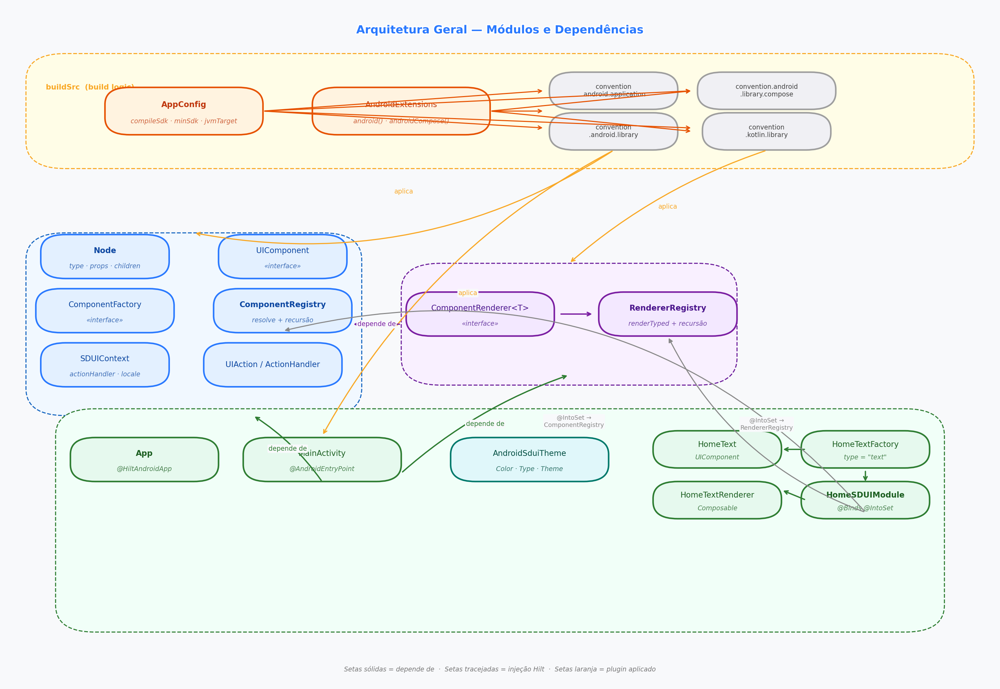
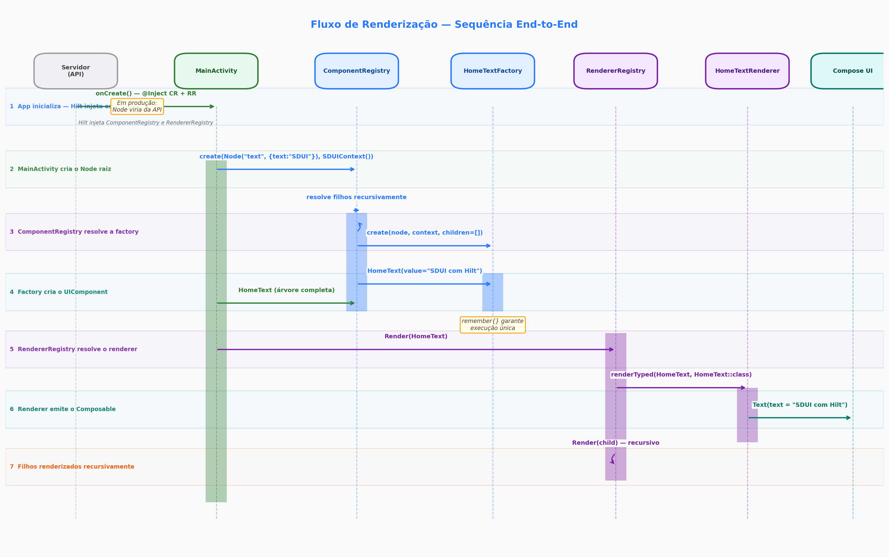
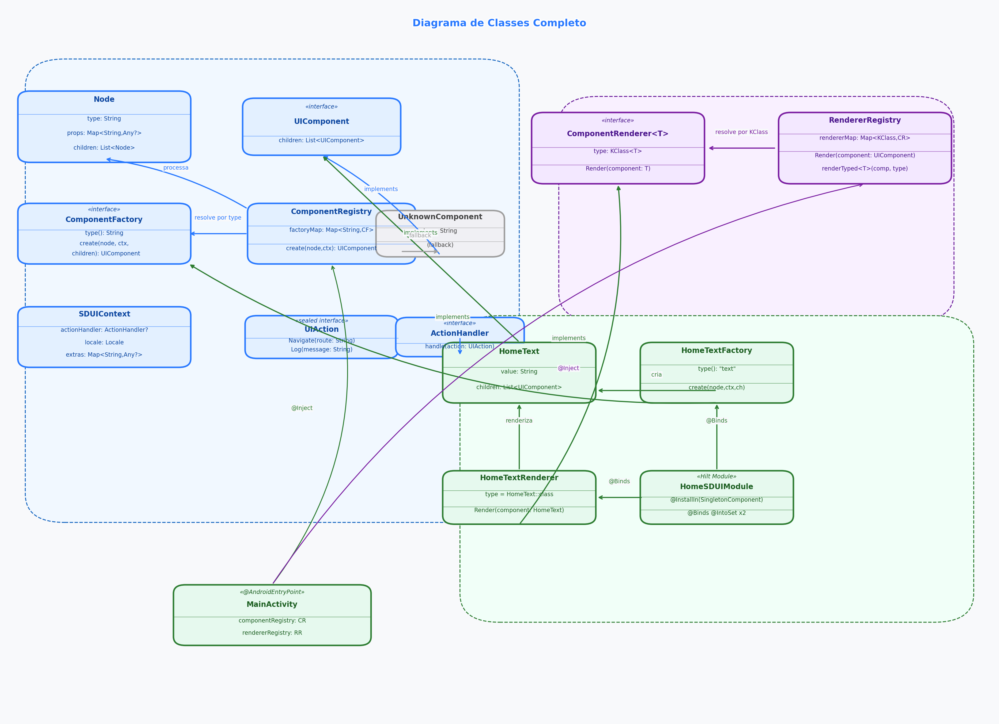
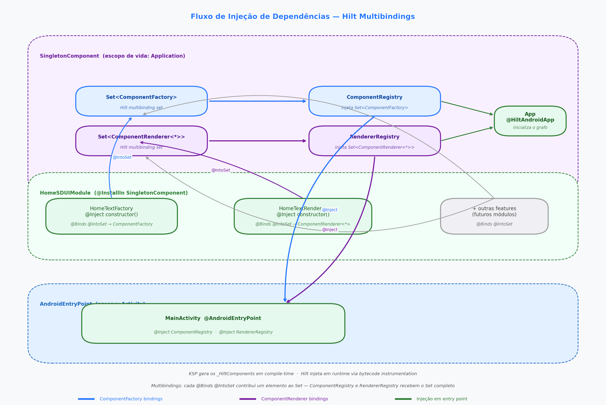

# Documentação — Android SDUI

Índice central de toda a documentação do projeto.

---

## Módulos

| Página | Descrição |
|---|---|
| [sdui-core](sdui-core.md) | Contratos, `Node`, `UIComponent`, `ComponentRegistry`, `SDUIContext`, `SduiJson` |
| [sdui-runtime](sdui-runtime.md) | `ComponentRenderer`, `RendererRegistry`, renderização recursiva em Compose |
| [sdui-components](sdui-components.md) | Implementações de componentes: `SduiText` e guia para novos componentes |
| [domain](domain.md) | `SduiRepository`, `FetchScreenUseCase`, `NodeMapper` |
| [feature/home](../feature/home/README.md) | `HomeScreen`, `HomeViewModel`, estados de UI e mock server |
| [app](app.md) | Entry point e fluxo completo |
| [buildSrc](buildsrc.md) | Convention plugins, `AppConfig`, extensões `android()` / `androidCompose()` |

---

## Visão geral

| Página | Descrição |
|---|---|
| [Arquitetura geral](architecture.md) | Fluxo end-to-end, diagramas de classes unificados, decisões de design |

---

## Diagramas

| | |
|---|---|
|  |  |
| **Arquitetura Geral** — [ver página](architecture.md) | **Fluxo de Renderização** — [ver página](architecture.md) |
|  |  |
| **Diagrama de Classes** — [ver página](sdui-core.md) | **Fluxo Hilt** — [ver página](architecture.md) |

---

## Voltar

[← README do projeto](../README.md)
