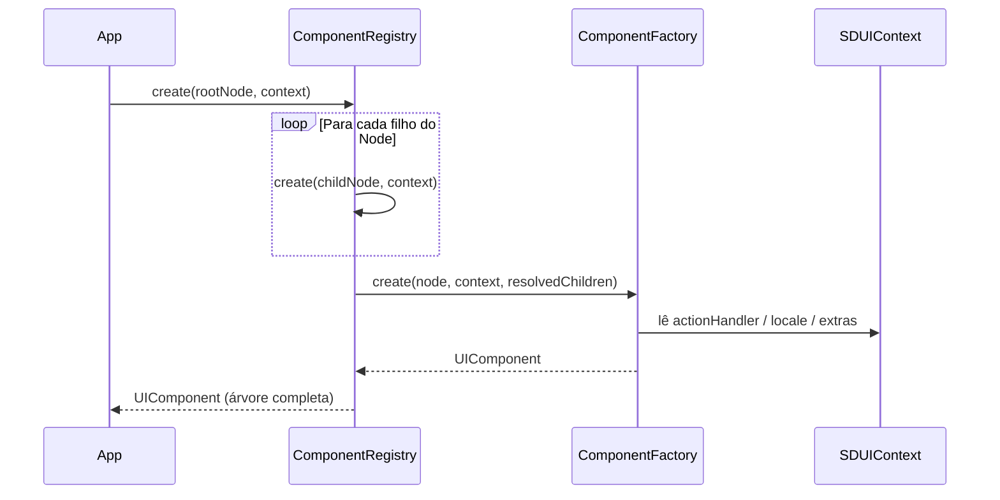

[← Índice](README.md) · [README do projeto](../README.md)

---

# Módulo: sdui-core

Camada de contratos e modelos do sistema SDUI. Não depende de Compose, Android SDK (exceto `android.util.Log`) nem de nenhuma outra camada do projeto — pode ser reutilizado em qualquer projeto Kotlin.

---

## Responsabilidades

- Definir o modelo de dados bruto recebido do servidor (`Node`)
- Contratar a interface de criação de componentes (`ComponentFactory`)
- Contratar a interface base de componentes de UI (`UIComponent`)
- Resolver a árvore de nós em árvore de componentes (`ComponentRegistry`)
- Propagar contexto de ambiente às factories (`SDUIContext`)
- Descrever ações de UI disparadas por componentes (`UIAction` / `ActionHandler`)

---

## Diagrama de classes


---

## Classes

### `Node`

Modelo de dados bruto recebido do servidor. É agnóstico a qualquer framework de renderização — representa apenas a intenção do servidor de exibir algo.

```kotlin
data class Node(
    val type: String,                    // "text", "button", "image"...
    val props: Map<String, Any?> = emptyMap(),   // dados arbitrários do servidor
    val children: List<Node> = emptyList()       // nós filhos (árvore)
)
```

Exemplo de payload JSON que se mapeia a um `Node`:

```json
{
  "type": "button",
  "props": { "label": "Saiba mais", "navigate": "/details" },
  "children": [
    { "type": "text", "props": { "text": "→" } }
  ]
}
```

---

### `UIComponent`

Interface base para todos os componentes tipados do sistema. Um `UIComponent` é o resultado da transformação de um `Node` por uma `ComponentFactory` — já tem tipo concreto e está pronto para ser renderizado.

```kotlin
interface UIComponent {
    val children: List<UIComponent>
        get() = emptyList()
}
```

---

### `UnknownComponent`

Componente de fallback criado automaticamente quando nenhuma `ComponentFactory` está registrada para o `type` do `Node`. Não é renderizado — apenas emite um aviso via `Log.w`.

```kotlin
data class UnknownComponent(val type: String) : UIComponent
```

---

### `ComponentFactory`

Interface que cada componente concreto deve implementar para ensinar o sistema a criar um `UIComponent` a partir de um `Node`.

```kotlin
interface ComponentFactory {
    fun type(): String   // deve bater com Node.type vindo do servidor

    fun create(
        node: Node,
        context: SDUIContext,
        children: List<UIComponent> = emptyList()
    ): UIComponent
}
```

Implementações são registradas no grafo Hilt com `@Binds @IntoSet` e descobertas automaticamente pelo `ComponentRegistry`.

---

### `ComponentRegistry`

Ponto central de resolução de factories. Recebe via Hilt multibindings o `Set<ComponentFactory>` completo e indexa por `type()`.

```kotlin
class ComponentRegistry @Inject constructor(
    factories: Set<@JvmSuppressWildcards ComponentFactory>
) {
    private val factoryMap = factories.associateBy { it.type() }

    fun create(node: Node, context: SDUIContext): UIComponent {
        val resolvedChildren = node.children.map { create(it, context) }  // recursivo

        return factoryMap[node.type]
            ?.create(node, context, resolvedChildren)
            ?: UnknownComponent(node.type)   // fallback seguro
    }
}
```

A resolução dos filhos é recursiva — toda a árvore de `Node` é convertida em árvore de `UIComponent` de uma só vez.

---

### `SDUIContext`

Contexto propagado a todas as factories durante a criação de componentes. Funciona como um envelope de ambiente — evita singletons e variáveis globais.

| Campo | Tipo | Descrição |
|---|---|---|
| `actionHandler` | `ActionHandler?` | Dispatcher de ações (navegação, logs etc). Nulo = ações ignoradas |
| `locale` | `Locale` | Locale atual do dispositivo |
| `extras` | `Map<String, Any?>` | Dados extras: userId, feature flags, parâmetros de tela |

---

### `UIAction` / `ActionHandler`

`UIAction` é uma sealed interface que define todas as ações possíveis que um componente pode disparar. `ActionHandler` é o contrato que a camada de aplicação deve implementar para tratá-las.

```kotlin
sealed interface UIAction {
    data class Navigate(val route: String) : UIAction
    data class Log(val message: String) : UIAction
}

interface ActionHandler {
    fun handle(action: UIAction)
}
```

Exemplo de implementação na camada de app:

```kotlin
class AppActionHandler(private val navController: NavController) : ActionHandler {
    override fun handle(action: UIAction) = when (action) {
        is UIAction.Navigate -> navController.navigate(action.route)
        is UIAction.Log      -> android.util.Log.d("SDUI", action.message)
    }
}
```

---

## Fluxo interno



---

[← Índice](README.md)
