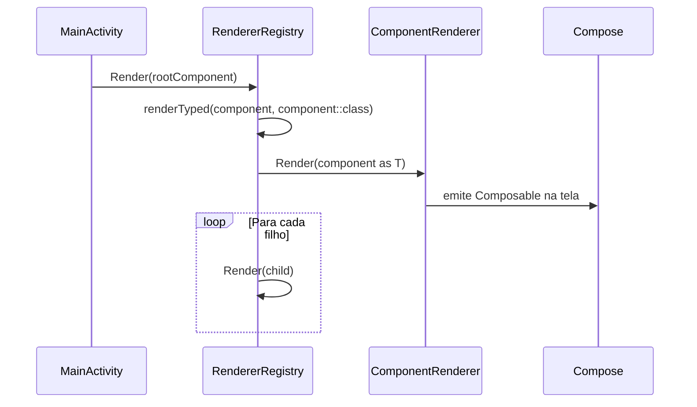

[← Índice](README.md) · [README do projeto](../README.md)

---

# Módulo: sdui-runtime

Camada de renderização do sistema SDUI. Depende de `sdui-core` e de Jetpack Compose, mas não conhece nenhuma feature concreta — é agnóstico ao que está sendo renderizado.

---

## Responsabilidades

- Contratar a interface de renderização de componentes em Compose (`ComponentRenderer`)
- Resolver e despachar componentes para seus renderers (`RendererRegistry`)
- Renderizar a árvore de `UIComponent` recursivamente

---

## Diagrama de classes


---

## Classes

### `ComponentRenderer<T>`

Interface genérica que cada renderer concreto deve implementar. O parâmetro de tipo `T` restringe o renderer a um único tipo de `UIComponent`, garantindo type-safety em tempo de compilação.

```kotlin
interface ComponentRenderer<T : UIComponent> {
    val type: KClass<T>   // chave usada pelo RendererRegistry

    @Composable
    fun Render(component: T)
}
```

A chave do mapa interno do `RendererRegistry` é `KClass<T>` — e não uma `String` — o que elimina erros de digitação e permite refactoring seguro com o IDE.

Implementações são registradas no grafo Hilt com `@Binds @IntoSet`:

```kotlin
@Binds @IntoSet
abstract fun bindHomeTextRenderer(renderer: HomeTextRenderer): ComponentRenderer<*>
```

---

### `RendererRegistry`

Ponto central de resolução de renderers. Recebe via Hilt multibindings o `Set<ComponentRenderer<*>>` completo e indexa por `type` (KClass).

```kotlin
class RendererRegistry @Inject constructor(
    renderers: Set<@JvmSuppressWildcards ComponentRenderer<*>>
) {
    private val rendererMap = renderers.associateBy { it.type }

    @Composable
    fun Render(component: UIComponent) {
        renderTyped(component, component::class)
    }

    @Suppress("UNCHECKED_CAST")
    @Composable
    private fun <T : UIComponent> renderTyped(component: UIComponent, type: KClass<T>) {
        val renderer = rendererMap[type] as? ComponentRenderer<T>
        if (renderer == null) {
            Log.w("RendererRegistry", "No renderer registered for type '${type.simpleName}'.")
            return
        }
        renderer.Render(component as T)          // cast seguro: type veio de component::class
        component.children.forEach { Render(it) } // renderiza filhos recursivamente
    }
}
```

#### Por que `renderTyped`?

O método `Render` recebe `UIComponent` (tipo genérico apagado em runtime por type erasure). Para fazer o cast seguro para `T`, é necessário capturar `component::class` antes de entrar no método genérico — é o que `renderTyped` faz. O `@Suppress("UNCHECKED_CAST")` é seguro porque o cast só ocorre após confirmar que o objeto é do tipo `T` via `type`.

---

## Fluxo de renderização



---

## Renderização recursiva de filhos

O `RendererRegistry` é responsável por renderizar os filhos de cada componente **após** a chamada a `Render`. Isso significa que os próprios renderers concretos **não precisam** se preocupar com filhos:

```kotlin
// HomeTextRenderer — não precisa chamar nada para os filhos
class HomeTextRenderer @Inject constructor() : ComponentRenderer<HomeText> {
    override val type = HomeText::class

    @Composable
    override fun Render(component: HomeText) {
        Text(text = component.value)
        // filhos serão renderizados automaticamente pelo RendererRegistry
    }
}
```

Isso mantém cada renderer simples e focado apenas na sua responsabilidade.

---

[← Índice](README.md)
